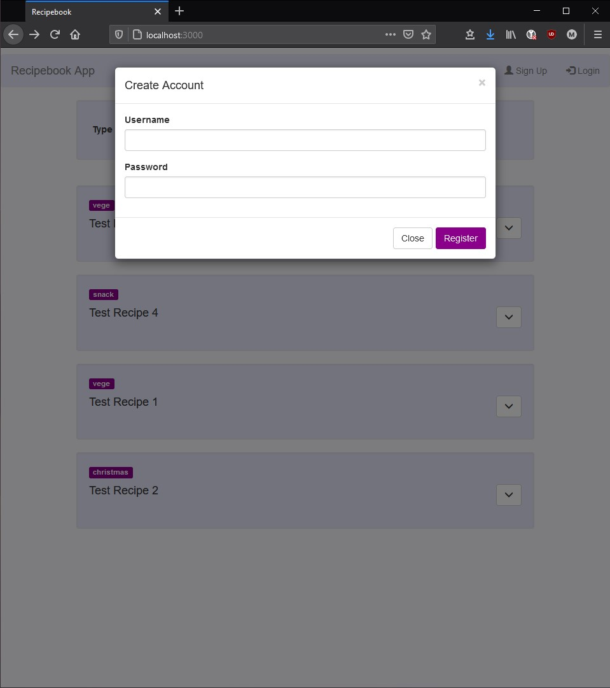
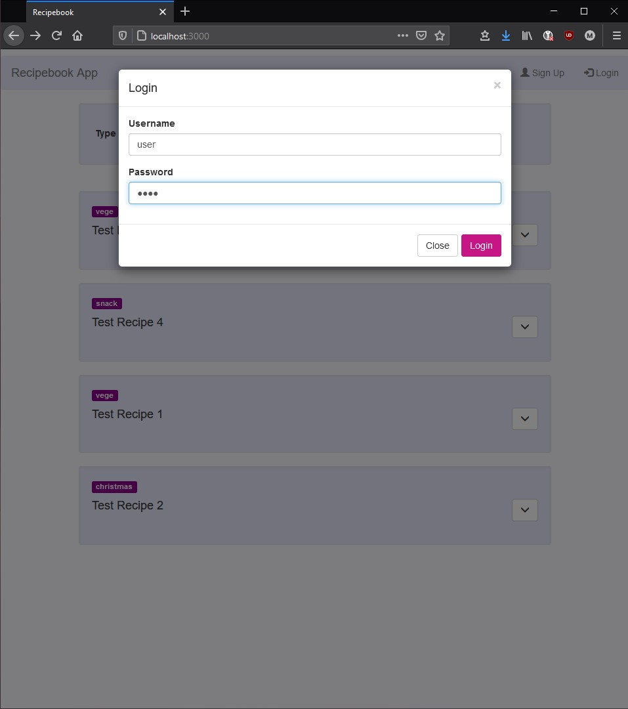
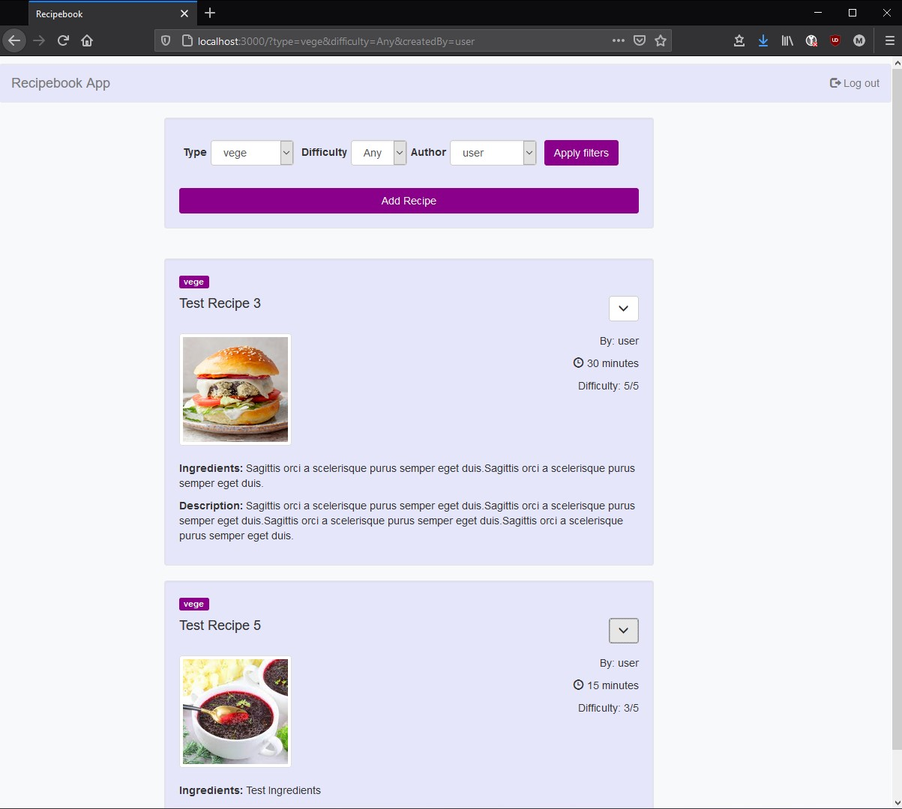
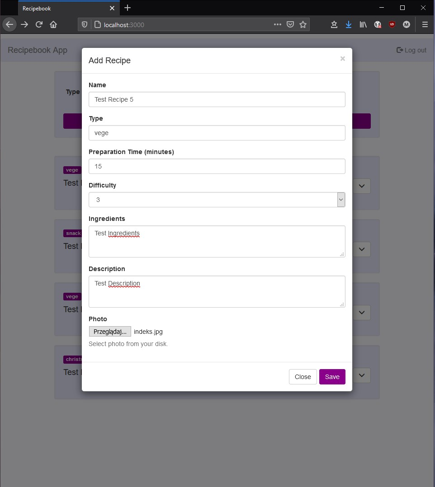
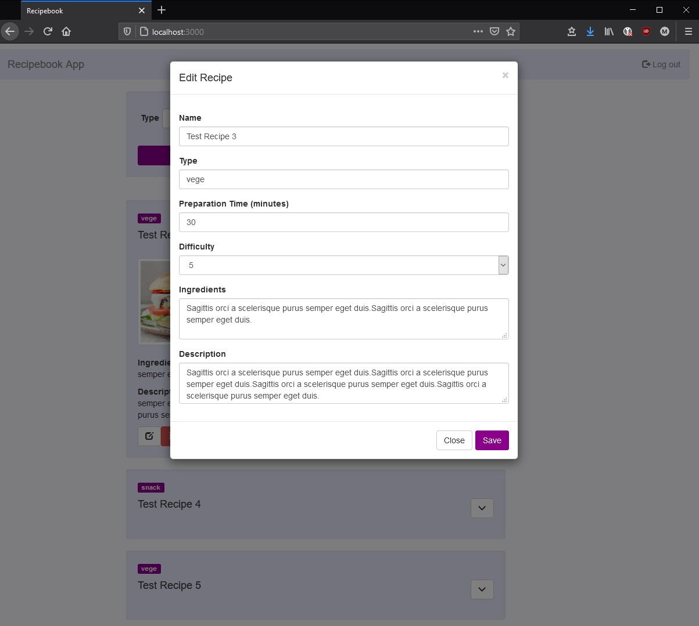
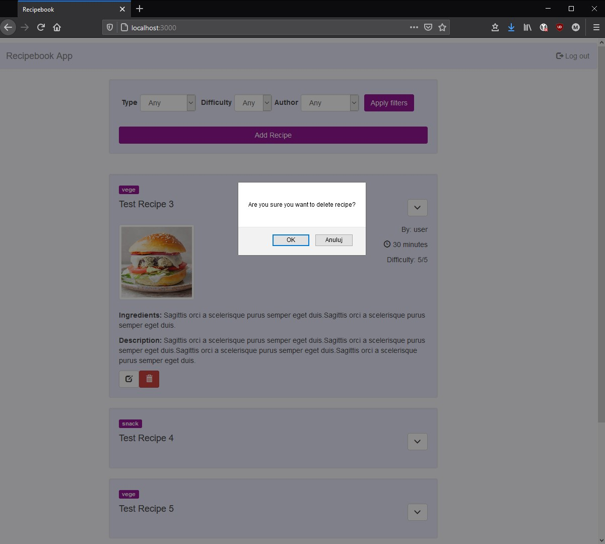

# Laboratorium 2 - Node.js + Frameworki 

## Zadanie
> Utwórz aplikacje służącą do katalogowania przepisów kulinarnych. W ramach realizacji zadania utwórz:
> - Źródło danych pozwalające przechowywać informacje na temat przepisów oraz autorów(rodzaj potrawy, trudność wykonania, składniki, czas wykonania, opis wykonania, zdjęcie, autor, itp.)
> - widoki niezbędne do prezentacji odpowiednich danych
> - logikę  dla budowanego systemu
>
> Uwaga:
> - przepis może dodać tylko osoba zarejestrowana w systemie
> - przepisy mogą przeglądać dowolne osoby korzystające z tego systemu
> - użytkownik może filtrować przepisy wg: rodzaju potrawy, trudności wykonania, autora
> - moderator systemu może zarządzać dokonywanymi wpisami z poziomu systemu, w tym celu niezbędne jest zdefiniowanie odpowiednich widoków i logiki

## Informacje ogólne

### Technologie
- NodeJS + Express + Dust
- PostreSQL
- Bootstrap

### Rejestracja

### Logowanie

### Przeglądanie przepisów i filtrowanie

### Dodawanie przepisu dostępne z poziomu zalogowanego użytkownika

### Edytowanie oraz usuwanie przepisów dostępne z poziomu moderatora

